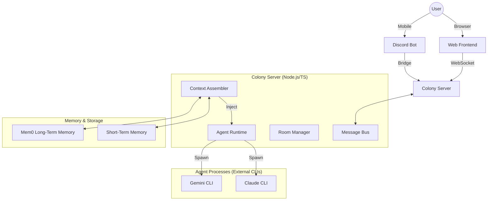

# Colony — Multi-LLM Agent Collaboration System

Colony is an advanced framework for autonomous multi-agent collaboration. It transforms native LLM CLI tools (such as Claude Code and Gemini CLI) into a unified, collaborative ecosystem where specialized agents work together to solve complex engineering tasks.

## 🚀 Overview

Unlike traditional chatbot interfaces, Colony provides a structured **environment** (Chat Rooms) where multiple agents can:
- **Collaborate**: Discuss architectural designs, write code, and perform QA in a shared context.
- **Utilize Tools**: Access the local filesystem, run shell commands, and manage complex workflows via an extensible "Skills" system.
- **Maintain Memory**: Leverage both session-based short-term memory and persistent long-term memory (via Mem0) to retain knowledge across sessions.
- **Self-Govern**: Follow a strict, automated development workflow with mandatory branching and quality guardrails.

---

## ✨ Key Features

- **Autonomous Multi-Agent Collaboration**: Real-time interaction between agents with specialized roles (Architect, Developer, QA, etc.).
- **Unified LLM Runtime**: Seamless routing between multiple models (Claude, Gemini, CodeX) via native CLI wrappers.
- **Persistent Long-Term Memory**: Integration with Mem0 for cross-session knowledge retention and semantic search.
- **Extensible Skill System**: Filesystem-based skill definitions (`SKILL.md` + `handler.sh`) discoverable by native CLIs.
- **Mandatory Development Workflow**: Enforced branching strategy (`feature/task-xxx`) and squash merges to ensure a clean and stable `master` branch.
- **Multi-Channel Access**: Interaction via a modern React-based Web UI or mobile-friendly Discord integration.
- **Vision Support**: Full support for image attachments in vision-capable models via base64 pipeline.

---

## 🏗️ Architecture

Colony follows a decoupled architecture separating the coordination layer from the execution runtime.



---

## 📁 Project Structure

- **`config/`**: YAML configurations for agents (roles, models, rules) and memory systems.
- **`docs/`**: Detailed implementation notes, research reports, and technical guides.
- **`logs/`**: Daily rotated persistent logs for system auditing.
- **`scripts/`**: Utility scripts, including Git hooks (`git-guard.sh`) and the Mem0 Python bridge.
- **`skills/`**: Extensible agent capabilities (Tools) implemented as bash handlers.
- **`src/`**: Core Backend (TypeScript)
    - **`agent/`**: Agent lifecycle, status management, and skill execution.
    - **`conversation/`**: Real-time chat room logic, session management, and the central message bus.
    - **`discord/`**: Discord bot implementation and the bridge to chat rooms.
    - **`llm/`**: Unified interface for native CLI invokers and model routing logic.
    - **`memory/`**: Context assembly pipeline, short-term history, and Mem0 integration.
    - **`server/`**: REST API and WebSocket server for frontend/agent communication.
- **`web/`**: Modern React + Vite frontend with real-time updates and monologue visualization.

---

## 🛠️ Tech Stack

- **Backend**: TypeScript, Node.js, Express, WebSocket (ws), Discord.js.
- **Frontend**: React 19, Vite, Lucide React, React Markdown.
- **Memory**: Python (Mem0 bridge), Qdrant/Chroma (Vector DB).
- **LLM Runtimes**: Claude Code CLI, Gemini CLI.

---

## ⚙️ Development Workflow

Colony enforces a strict engineering workflow to ensure code quality and system stability.

1.  **Mandatory Branching**: Direct commits to `master` are blocked by a Git pre-commit hook.
2.  **Task Initialization**: All tasks must be initialized using specialized workflow skills:
    - **`quick-task`**: For small fixes or rapid iterations (< 1 hour).
    - **`dev-workflow`**: For large features involving architectural changes and multi-agent reviews.
3.  **Automated Management**: Workflow skills automatically create `feature/task-xxx` branches and perform **Squash Merges** upon completion to keep the Git history clean.

---

## 🚀 Getting Started

### Prerequisites

- Node.js 18+ and npm.
- Python 3.8+ (for Mem0 long-term memory).
- Native LLM CLIs installed and authenticated (`claude`, `gemini`).

### Installation

1.  **Clone the repository**:
    ```bash
    git clone https://github.com/your-repo/colony.git
    cd colony
    ```
2.  **Install dependencies**:
    ```bash
    npm install
    cd web && npm install && cd ..
    pip install -r requirements-mem0.txt
    ```
3.  **Setup environment**:
    ```bash
    cp .env.example .env
    # Edit .env with your API keys and configuration
    ```
4.  **Build and Run**:
    ```bash
    npm run build
    npm start
    ```
5.  **Access the UI**: Open `http://localhost:3000` in your browser.

---

*Colony — Orchestrating intelligence, one room at a time.*
