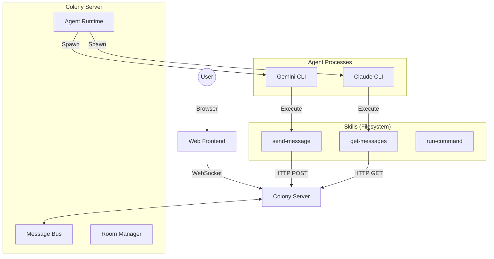

# Colony — Multi-LLM Agent Collaboration System

Colony is an experimental multi-agent collaboration framework that turns standard LLM CLIs (Claude, Gemini, CodeX) into autonomous, collaborative agents.

## Original Design
设计一个多llm agent协作系统，协同完成通用任务，或一起讨论问题、得出结论。设计能力如下，细化目标并给出每一步实现计划

1. llm agent
   1. 可以通过配置文件创建agent
   2. 通过cli访问大模型（因为cli支持oauth和api key两种模式），目前已经有了使用nodejs实现的cli适配层
   3. Rate Limit Manager：需要监控Gemini、CodeX和Claude的剩余额度与上下文，当额度耗尽时自动暂停或切换模型。
   4. agent能力参考claude code
2. 对话管理
   1. 设计一个前端，可以创建/切换会话，显示会话状态、agent状态等
   2. agent可以通过skill在聊天群中发送消息（即不把模型响应直接发送到聊天群中，而是让模型通过skill主动发送消息）
   3. 在聊天室内，对话内容对在这个聊天室内的agent都可见（消息路由模式：广播给所有agent，由agent自己决定是否发言）
   4. 支持@，可以agent@agent、agent@人类、人类@agent
   5. 会话隔离，新建会话后不会受到已有会话的影响
   6. 会话管理器接入discord，使得人类可以在移动端管理和进入会话，比如1、通过命令切换/新建会话，进入某一个会话后可以直接参与对话（但不会看到历史内容）、查看信息（比如各token消耗量）2、某个聊天室内的任务完成了某个阶段之后会主动发送消息
3. 会话管理
   1. 支持保存/恢复会话上下文
4. 记忆管理
   1. 调研目前现有的记忆管理组件，在现有组件的基础上构建一个长短期记忆系统，节省token
   2. 推荐hindsight
   3. 有一个他人的四层系统可供参考
      1. Layer 4: 上下文调度 — 多猫协作时的共享/隔离、跨 window 状态传递
      2. Layer 3: 上下文组装 — System Prompt 结构化、Skills 动态注入  
      3. Layer 2: 上下文检索 — RAG、Memory 系统、Context Lineage
      4. Layer 1: 上下文索引 — 代码解析、语义嵌入、知识图谱
5. 如果涉及代码开发，通过skill注入开发流程。参考https://github.com/zuiho-kai/bot_civ/blob/main/docs/workflows/development-workflow.md

## Design Philosophy

### 1. Unified Agent Runtime
Instead of building custom chat loops, Colony **wraps native CLI tools**.
- Each agent is a spawned process (e.g. `gemini -p ...`, `claude -p ...`).
- Colony manages the lifecycle, injects context, and routes messages.
- The underlying CLI handles the "thinking" and "tool execution" loop.

### 2. Filesystem-based Skills (`SKILL.md`)
Skills are defined as folders on the filesystem, making them discoverable by both Colony and the native CLIs.
- **Metadata**: `SKILL.md` (frontmatter + instructions).
- **Execution**: `scripts/handler.sh` (bash scripts executed by the CLI).
- **Native Integration**: Skills are symlinked into `.gemini/skills/` and `.claude/skills/`, allowing the CLIs to discover and use them natively.

### 3. "YOLO" Execution
To enable true autonomy, agents run with auto-approval flags (`--yolo`, `--dangerously-skip-permissions`). This allows them to execute bash scripts (skills) without human intervention, chaining thoughts and actions into complex workflows.

### 4. Centralized Message Bus
The Colony server acts as the "chat room" or "environment".
- Agents communicate primarily by calling the `send-message` skill.
- The server routes these messages to the web UI and other agents.
- @mentions are supported to direct attention.

## Architecture



## Implementation Status

### ✅ Completed
- **Phase 0: Planning**: Architecture design, implementation plan.
- **Phase 1: Core Framework**: Agent configuration, runtime lifecycle, Rate Limit Manager.
- **Phase 2: Conversation Management**: Message bus, Chat Rooms, Session isolation.
- **Phase 3: Frontend**: Express server, Web UI with real-time updates.
- **Phase 3.5: Standard Skills**: Local `SKILL.md` definitions, `SkillLoader`, unified skill system.
- **Phase 3.6: Native CLI Integration**:
  - `handler.sh` scripts for skills.
  - Symlinking skills for native CLI discovery.
  - Environment variable injection (`COLONY_AGENT_ID`, etc.).
  - Fixes for native tool execution tracking (skips internal JSON parsing loop).

### 🚧 Pending / In Progress
- **Phase 4: Memory Management** ✅
  - [x] Four-layer context system design
  - [x] Short-term memory (conversation window, summary compression)
  - [x] Context assembly pipeline (system prompt + skills + RAG)
  - [x] Context scheduler (memory sharing, cross-session transfer, lifecycle)
  - [x] Long-term memory (Mem0 integration with semantic search)
- **Phase 5: Discord Integration** ✅
  - [x] Discord bot: create/switch sessions, enter conversations
  - [x] Bridge between Discord messages and chat rooms
  - [x] Task milestone notifications
  - [x] Mobile-friendly commands and messaging
- **Phase 6: Development Workflow Integration**
  - [x] Development workflow skill (8-stage process)
  - [x] Role assignment for agents (Architect, Tech Lead, QA Lead, Developer)
  - [x] Workflow state machine and checkpoint tracking
- **Phase 7: Verification & Polish**
  - [ ] Token usage / rate limit dashboard
  - [ ] End-to-end integration testing
  - [ ] Performance & reliability testing
  - [ ] Documentation

## Getting Started

### Prerequisites

1. **Node.js 18+** and **npm**
2. **Python 3.8+** (for Mem0 long-term memory)
3. **Vector Database** (optional, for long-term memory):
   - Qdrant (recommended): `docker run -p 6333:6333 qdrant/qdrant`
   - Or Chroma (embedded, no setup needed)

### Installation

1. **Install Dependencies**: `npm install`
2. **Install Python Dependencies** (for Mem0): `pip install -r requirements-mem0.txt`
3. **Setup Environment Variables**:
   ```bash
   cp .env.example .env
   # Edit .env and add your API keys
   export OPENAI_API_KEY=sk-...  # For Mem0 memory extraction
   ```
4. **Setup Skills**: Ensure `skills/` directory is populated.
5. **Build**: `npm run build:server`
6. **Run**: `npm start`
7. **Web UI**: Open `http://localhost:3000`

### Alternative: Use Local Models (Free, No API Keys)

Instead of OpenAI, you can use local models with Ollama:

```bash
# Install Ollama
curl https://ollama.ai/install.sh | sh

# Pull models
ollama pull llama3
ollama pull nomic-embed-text

# Update config/mem0.yaml to use Ollama
# See docs/mem0-custom-api-guide.md for details
```

**Benefits:**
- ✅ Completely free
- ✅ No API keys needed
- ✅ Privacy (runs locally)
- ✅ No rate limits

See `docs/mem0-custom-api-guide.md` for more options (Groq, Together AI, OpenRouter, etc.)

### Quick Start (Without Long-Term Memory)

If you want to skip Mem0 setup for now:
1. Skip step 2 (Python dependencies)
2. Long-term memory features will be disabled
3. Short-term memory and context assembly will still work

See `docs/mem0-integration-guide.md` for detailed Mem0 setup.

## Logging

Colony features a structured logger with console output and optional file persistence.
- **Console**: ANSI-colored output with component tagging.
- **File Persistence**: Logs are stored in the `logs/` directory (configurable via `LOG_DIR`).
- **Date Rotation**: Log files are automatically rotated by date (e.g., `colony-2026-02-23.log`).

Configure logging in your `.env` file:
```bash
LOG_LEVEL=info
LOG_TO_FILE=true
LOG_DIR=logs
```

## Agents Configuration

Agents are defined in `agents.yaml` (or JSON):
```yaml
agents:
  - id: "architect"
    name: "Architect"
    role: "System Designer"
    model: "claude"
    skills: ["send-message", "get-messages", "read-file"]
  - id: "developer"
    name: "Developer"
    role: "Implementation Expert"
    model: "gemini"
    skills: ["send-message", "run-command", "write-file"]
```